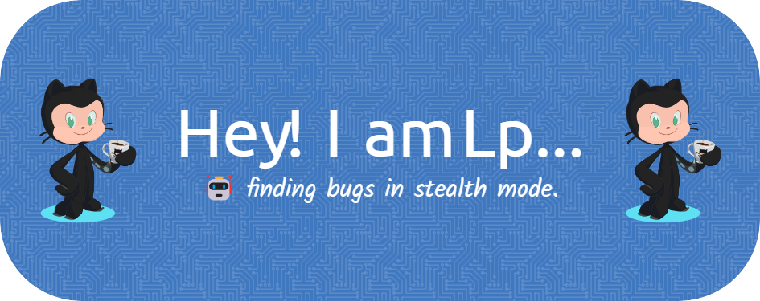

<<<<<<< HEAD

Welcome to my GitHub profile! 

🚀 **About Me:**
- 📚 Lifelong learner always exploring new technologies and frameworks.

🛠️ **Tech Stack:**
- **Languages:** 
  
  

- **Web Development:** 
  
  
  
  
  

- **Testing:** 
  
  
  

- **DevOps:** 
  
  

- **Automation:** 
  
  

- **IoT:** 
  
  

🤝 **Let's collaborate and build amazing things together! Feel free to explore my repositories and reach out for any collaboration or discussion.**
=======
# Hi, I'm Lp 👋

🚀 **About Me:**
- Lifelong learner exploring new technologies and frameworks.
>>>>>>> 2513fbe7898abfe9d010876381e37fdd0be208d6
